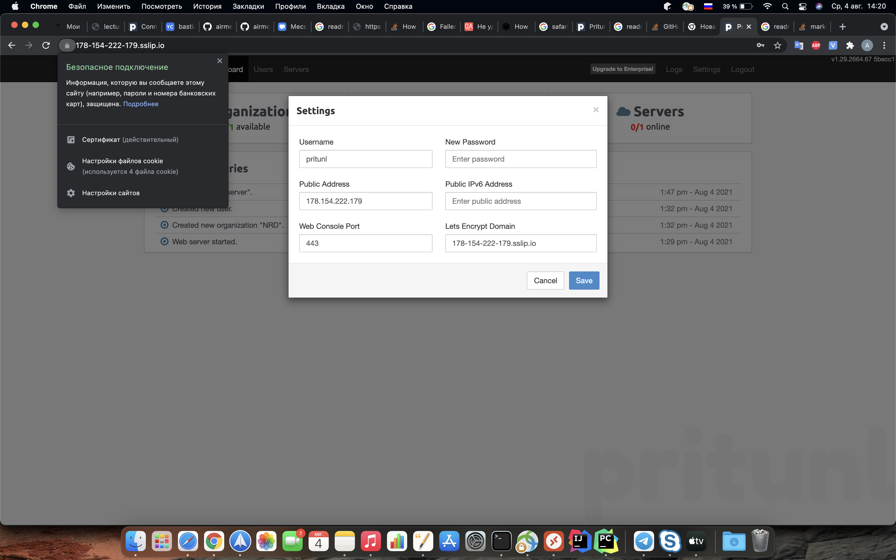

# zolo20_infra
zolo20 Infra repository


bastion_IP = 178.154.222.179
someinternalhost_IP = 10.128.0.21

## ДЗ 03

## Подключение через бастион хост

Для подключения к someinternalhost_IP напярмую с локальной машины
необходимо создать файл ~/.ssh/config и прописать:

```
Host 178.154.222.179
	User appuser
	IdentityFile ~/.ssh/appuser

Host 10.128.0.21
	User appuser
	IdentityFile ~/.ssh/appuser
	ProxyJump 178.154.222.179
```

### Дополнительное задание

Подключение через `ssh someinternalhost`

В файле ~/.ssh/config прописать:

```
Host 178.154.222.179
	User appuser
	IdentityFile ~/.ssh/appuser

Host someinternalhost
	User appuser
	Hostname 10.128.0.21
	IdentityFile ~/.ssh/appuser
	ProxyJump 178.154.222.179
```

## VPN-сервер для серверов Yandex.Cloud

На сервере bastion_IP выполнить команду:

>sudo bash [setupvpn.sh](setupvpn.sh)

Следуем инструкциям установщика по адресу:

>https://<bastion_IP>/setup

После настройки создаем пользователя
test с PIN 6214157507237678334670591556762,
добавлем сервер и организацию и включаем в организацию
пользователя и сервер.

>Файл настройки клиента VPN - [cloud-bastion.ovpn](cloud-bastion.ovpn)

### Дополнительное задание: валидный сертификат для панели управления VPN сервера

Прописать в settings в параметр Lets Encrypt Domain
домен для bostion - 178-154-222-179.sslip.io

Доступ к printunl - https://178-154-222-179.sslip.io


